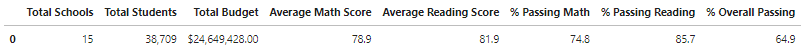
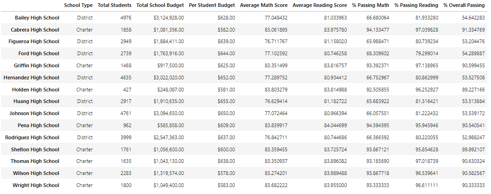
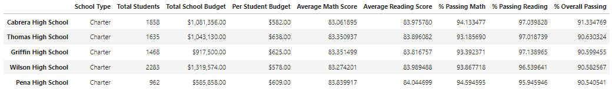
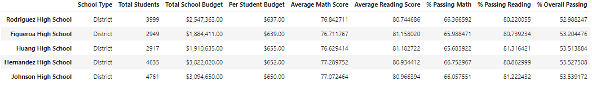
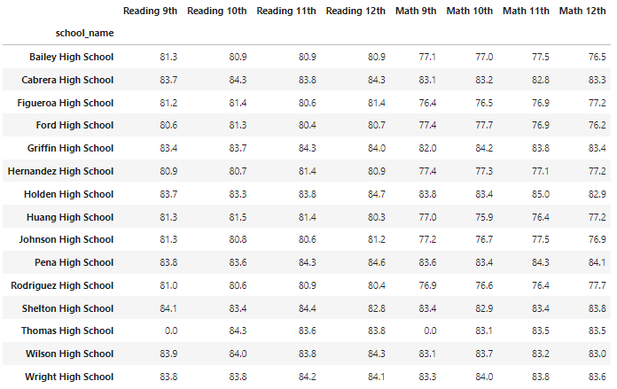
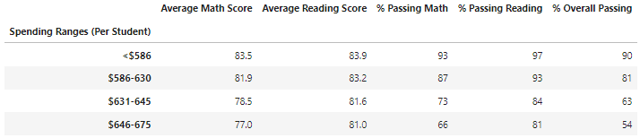
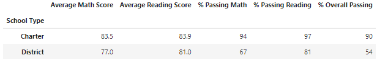

# Module 4 Challenge - Overview of PyCity School District Analysis
An analysis was performed on standardized math and reading test scores for 15 schools within the PyCity school district. Based on the data provided, Thomas High School is showing possible evidence of academic dishonesty for 9th graders for both reading and math scores. Therefore, the analysis will be performed again, but will exclude test scores from 9th graders at Thomas High School.

## Summary of Tasks
* Removal of 9th grader reading and math test scores for Thomas High School from the dataset 

Tables presenting each of the following metrics:
* A high-level summary of the district's key metrics
* An overview of the key metrics for each school
* Top 5 and bottom 5 performing schools, based on the overall passing rate
* The average math score received by students in each grade level at each school
* The average reading score received by students in each grade level at each school
* School performance based on the budget per student
* School performance based on the school size 
* School performance based on the type of school

## Resources
- Data Source: schools_complete.csv, students_complete.csv
- Software: Python 3.9.12, Jupyterlab 3.3.2, Pandas 1.4.2, Numpy 1.21.5

## Summary of Results
### Summary of School District Analysis

### Performance Summary by School Name

### Top Five (5) Performing Schools

### Lowest Five (5) Performing Schools

### Math and Reading Scores by Grade Level

### School Performance and School Spending Analysis

### School Performance and School Size Analysis

### School Performance and School School Type Analysis

### School Performance and School School Type Analysis

## Final Conclusion Statement

